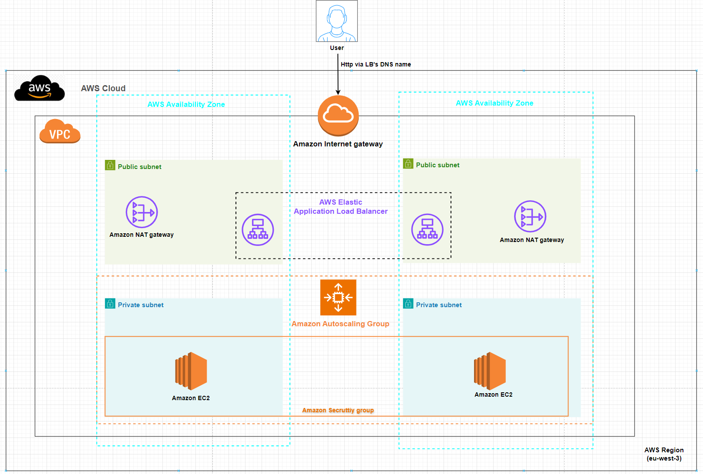

# Topic 6 - Simple http website hosted on loadbalancing & autoscaling private backend(ELB+EC2+VPC+Autoscaling+SNS)
##  Yuanchao Hands-on Project

## This readme is more readable [here](https://github.com/lyc-handson-aws/handson-topic6)

## **Overview**

**Project's main features**
:point_right: A simple website(one web page) accessible via a load balancer,the website is auto-scaled

:point_right: the servers that host the website are not accessible through extern

:point_right: the accessibility is controlled at network zone level

:point_right: Check the website via load balancer's DNS name: [here](http://stack--myelb-yofujol026w2-892332491.eu-west-3.elb.amazonaws.com/)

# What could be learned in this topic

1. How to build a VPC (network zone) with an Internet Gateway (internet entry).
2. How to configure private and public subnets.
3. How to configure a public subnet with a NAT Gateway.
4. How to configure Route Tables and Routes to associate public and private subnets.
5. How to configure Security Groups.
6. How to configure and use an Elastic Load Balancer.
7. How to configure an EC2 Launch Template to be used by Auto Scaling.
8. How to configure and use Auto Scaling and Auto Scaling Groups.
9. How to set up an SNS topic and use it with an Auto Scaling Group.

## **Architecture**
the diagram below illustrates the architecture(principle) of this project:

## Continue Deployment
CloudFormation stack's deployment: see GitHub workflows https://github.com/lyc-handson-aws/handson-topic6/blob/master/.github/workflows/action-cf.yaml

## **CloudFormation Stack Quick-create Link**
Click here to quickly create a same project with the same AWS resources:  [here](https://eu-west-3.console.aws.amazon.com/cloudformation/home?region=eu-west-3#/stacks/create/review?templateURL=https://s3bucket-handson-topic1.s3.eu-west-3.amazonaws.com/CF-template-handson-topic6.yaml)
**See Stack's description for complete actions to reproduce the same project**

> the default stack's region "Europe (Paris) eu-west-3"

## **AWS Resources**
Project's AWS resources:

:point_right: AWS::EC2
- AWS::EC2::VPC - project's host network zone
- AWS::EC2::InternetGateway - host network zone's entry
- AWS::EC2::Subnet - 2 availability zone, in each availability zone there is a private and a public subnet
- AWS::EC2::RouteTable-  2 routetable, one for private zone, one for public zone.
- AWS::EC2::Route  2 route, one for private zone: redirect all external target traffic to netgateway , one for public zone redirect all external target traffic to InternetGateway
- AWS::EC2::EIP - 2 IP attached to public zone for 2 private zone
- AWS::EC2::NatGateway - 2 gateway as entry of private zone. it's attached to public zone, using eip
- AWS::EC2::SecurityGroup - 2 secrutiygroup one for ec2, one for loadbalance
- AWS::EC2::LaunchTemplate - EC2 launchtemplate used by autoscaling, in the template each EC2 generated create a simple apache website with a web page, in which the content is random

:point_right:AWS::AutoScaling::AutoScalingGroup - autosale in private zones

:point_right: AWS::SNS::Topic - send notification to email, used by autoscaling group

:point_right: AWS::ElasticLoadBalancingV2
- AWS::ElasticLoadBalancingV2::Listener - define how loadbalancer receive the flow
- AWS::ElasticLoadBalancingV2::TargetGroup - define how loadblancer send the flow to
- AWS::ElasticLoadBalancingV2::LoadBalancer - create the loadblancer